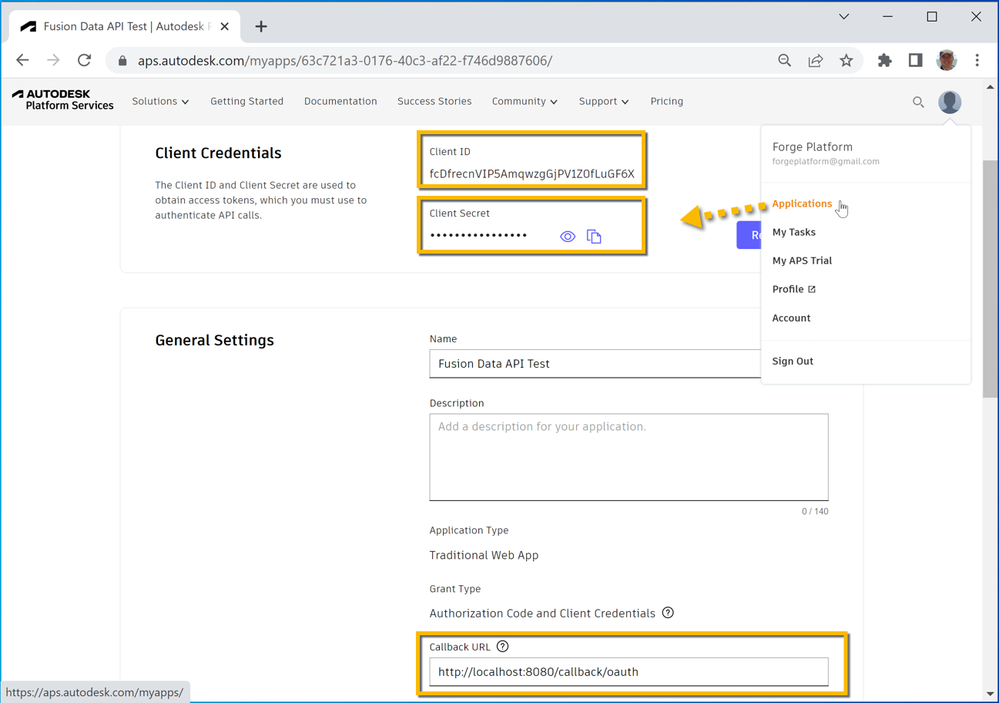
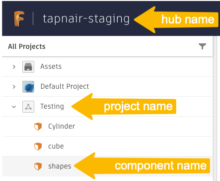

# Use Custom Properties

## Setting up your test
In the **terminal** run this to install all the necessary components
```
npm i
``` 

You will need to set the value of `clientId` and `clientSecret` variables in `index.js` based on your **APS app**'s credentials and make sure that the `Callback URL` of the app is set to `http://localhost:8080/callback/oauth` as shown in the picture\


You will also need to set the value of `hubName`, `projectName` and `componentName` variables. You can find them either in **Fusion Teams** web app, in **Fusion 360** or any other place that lets you navigate the contents of your **Autodesk** hubs and projects - including the **Manufacturing Data Model API** itself\



## Running the test
In a **terminal**, you can run the test with:
```
npm start
```
As instructed in the console, you'll need to open a web browser and navigate to http://localhost:8080 in order to log into your Autodesk account 

> [!IMPORTANT]
> The sample requires that the person logged in is both the **owner** or **editor** of the APS app whose credentials (client id and client secret) are used and also the **admin** of the Fusion hub that you want to link the property definition collection to.  

## Output
```
Open http://localhost:8080 in a web browser in order to log in with your Autodesk account!
Creating collection: MyTestCollection1
Creating property: MyTestProperty1
Linking collection: MyTestCollection1 to hub id: urn:adsk.ace:prod.scope:4312f8a4-59a8-4e12-ba18-cb0a3517d7e6
Setting property: MyTestProperty1 to component id: cHJvZHVjdH5jby5YcTNkbGVwSlF3cTBXR0lUT1BkeHFnfk5UWVo0Ujl3RTFrY1h3YTZEWGpmYnhfYWdh with value: MyTestPropertyValue2
```

## Workflow explanation

The workflow can be achieved following these steps:

1. Create property definition collection if does not exist already
2. Create property definition inside that collection if does not exist already
3. Link the collection to the hub
4. Set the property of a specific component based on its hub, project and component name

## Manufacturing Data Model API Query

In `app.js` file, the following GraphQL query traverses the hub, project and its rootfolder to set the value of a custom property for a given component
```
async addPropertyWithValue(hubName, projectName, componentName, collectionName, propertyName, propertyValue) {
  try {
    let { hubId, projectId } = await this.getHubAndProjectId(hubName, projectName);

    let modelId = await this.getModelId(projectId, componentName);

    let collections = await this.getCollections();

    let collection = collections.find(col => col.name === collectionName);

    if (!collection) {
      console.log(`Creating collection: ${collectionName}`);
      collection = await this.createCollection(collectionName);
    } else {
      console.log(`Collection: ${collectionName} already exists.`);
    }

    let properties = await this.getProperties(collection.id);

    let property = properties.find(prop => prop.name === propertyName);

    if (!property) {
      console.log(`Creating property: ${propertyName}`);
      property = await this.createProperty(collection.id, propertyName);
    } else {
      console.log(`Property: ${propertyName} already exists.`);
    }

    console.log(`Linking collection: ${collection.name} to hub id: ${hubId}`);
    await this.linkCollection(collection.id, hubId);

    let componentId = await this.getComponentId(modelId);

    console.log(`Setting property: ${property.name} to component id: ${componentId} with value: ${propertyValue}`);
    await this.setProperty(property.id, componentId, propertyValue);
  } catch (err) {
    console.log("There was an issue: " + err.message)
  }
}
```

-----------

Please refer to this page for more details: [Manufacturing Data Model API Docs](https://aps.autodesk.com/en/docs/mfgdatamodel-publicbeta/v2/developers_guide/overview/)