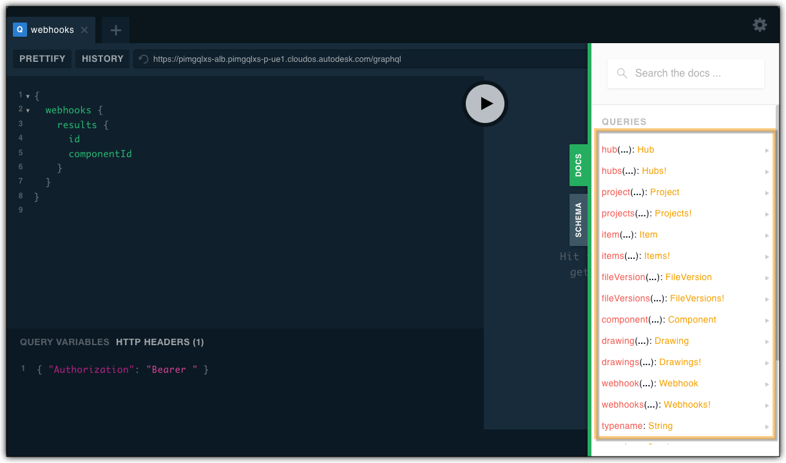
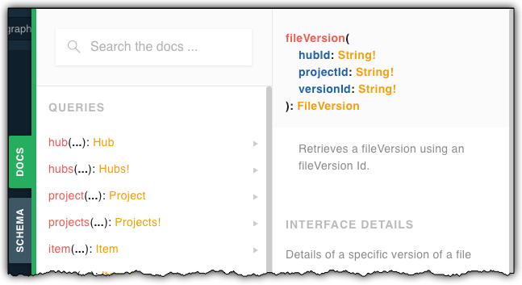

# Manufacturing Data Model Samples


[](http://opensource.org/licenses/MIT)


**APS API:** [](https://aps.autodesk.com/en/docs/oauth/v1/developers_guide/overview/)
[](https://aps.autodesk.com/developer/overview/manufacturing-data-model-api)

---

This repository contains several samples illustrating use of Manufacturing Data Model API in context of various workflows:

1. [Read the Complete Model Hierarchy of a Design](./1.Read%20the%20Complete%20Model%20Hierarchy%20of%20a%20Design) 

   -  based on the **path to a model** (hub name, project name and file name) you can get the full model hierarchy - similar to what is shown inside **Fusion 360**.

2. [Find the Thumbnail of a specific Part](./2.Find%20the%20Thumbnail%20of%20a%20specific%20Part)
   
	-  based on the **path to a model** (hub name, project name and file name) you can get the thumbnail of a given model.

4. [Get Physical Properties for Component](./3.Get%20Physical%20Properties%20for%20Component)
   
	-  based on the **path to a model** (hub name, project name and file name) generate a physical properties (like bounding box, mass, etc) for a given model.

---

## Prerequisites
1. **APS Account**: Learn how to create a APS Account, activate subscription and create an app at [this tutorial](https://tutorials.autodesk.io/);
2. [Node.Js](https://nodejs.org) with version > v16.13.2 and basic knowledge of JavaScript;


## Notes

Though the samples start with the `hubs(){}` query, there are many other options for you. The easiest is to check the **QUERIES** section on the **DOCS** tab in the [Data Explorer sample](https://github.com/autodesk-platform-services/aps-data-explorer) to see what other starting points are available.



As you can see, you could e.g. start directly with a given file version if you already know the parameters it requires: `hubId`, `projectId` and `versionId`. Perhaps you already have the necessary values from a previous **GraphQL** request or via the [Data Management API](https://aps.autodesk.com/en/docs/data/v2/developers_guide/overview/) 



In that case the query might look like this:

```
{
  fileVersion(
    hubId: "a.YnVzaW5lc3M6YXV0b2Rlc2s2MTA0",
    projectId: "a.YnVzaW5lc3M6YXV0b2Rlc2s2MTA0IzIwMjIwMjA0NDkzNjczNjA2",
    versionId: "urn:adsk.wipprod:fs.file:vf.0pdKmY_sTHW957H5fthyLw?version=5"
  ) {
    ... on DesignFileVersion {
      id
      rootComponent {
        name
      }
    }
  }
}
```
and the reply could be:
```
{
  "data": {
    "fileVersion": {
      "id": "urn:adsk.wipprod:fs.file:vf.0pdKmY_sTHW957H5fthyLw?version=5",
      "rootComponent": {
        "name": "Box"
      }
    }
  }
}
```

You could also get to a specific **folder** or **file** using the `item(){}` query if you know the id of the specific **file** or **folder**, e.g.:
```
{
  item(
    hubId: "a.YnVzaW5lc3M6YXV0b2Rlc2s2MTA0",
    projectId: "a.YnVzaW5lc3M6YXV0b2Rlc2s2MTA0IzIwMjIwMjA0NDkzNjczNjA2",
    itemId: "urn:adsk.wipprod:fs.folder:co.SC8l0gh1RKa_MkpcNCYExw"
  ) {
    ... on Folder {
      name
    }
  }
}
```
and the reply could be:
```
{
  "data": {
    "item": {
      "name": "Test folder"
    }
  }
}
```

# License

These samples are licensed under the terms of the [MIT License](http://opensource.org/licenses/MIT). Please see the [LICENSE](LICENSE) file for full details.

# Written by

Adam Nagy [adam.nagy@autodesk.com](adam.nagy@autodesk.com), [Autodesk Partner Development](http://aps.autodesk.com)

Denis Grigor [denis.grigor@autodesk.com](denis.grigor@autodesk.com), [Autodesk Partner Development](http://aps.autodesk.com)
